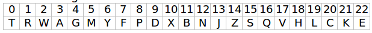
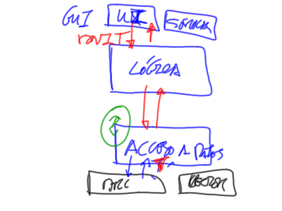

 
Kata sobre Programación Orientada a Objetos
===========================================

Código en: 

Python -> https://github.com/dfleta/dni

Java -> https://github.com/dfleta/Java 

### Documentación

Vas a tener que tomar múltiples decisiones a la hora de construir un programa bajo el paradigma de la Programación Orientada a Objetos (POO). Este documento Working Classes te ayudará no sólo a tomar estas decisiones de manera rápida, sino también a construir una arquitectura de la aplicación que respete los principios SOLID.
Cómo manejar los errores y la programación por contrato, en el documento Programación Defensiva.

### SOLID
Aplicad los principios SOLID que ya conocéis:
 - SRP (S) o Principio de Única Responsabilidad (Single Responsibility Principle): una clase o componente sólo debe exhibir un motivo para cambiar.
 - OCP (O) o Open/Closed Principle. Las entidades de software (clases, módulos, funciones, etc.) deben estar “abiertas” a la extensión pero “cerradas” a la modificación.
 - LSP (L) o Principio de sustitución de Liskov: los objetos de un programa deberían ser reemplazables por instancias de sus tipos base sin alterar el correcto funcionamiento del programa (herencia y polimorfismo).

Todos estos principios están explicados en el libro [_Agile Principles Patterns and Practices in C, by Micah Martin, Robert C. Martin_](https://www.oreilly.com/library/view/agile-principles-patterns/0131857258/)

Vamos a ponerlos en práctica con el siguiente kata.

## SOLID DNI KATA - SRP y OCP 

Escribe un programa que dado un número de DNI obtenga la letra del NIF. La letra correspondiente a un DNI se calcula mediante el siguiente algoritmo: 
 1. Se obtiene el resto de dividir el número de DNI entre `23`.
 2. El número resultante indica la posición de la letra correspondiente a ese DNI en la siguiente cadena:

No se utilizan las letras: `I`, `Ñ`, `O`, `U`.
La `I` y la `O` no se emplean para evitar confusiones con otros caracteres, como `1`, `l` ó `0`.

Construye el programa diseñando un **ADT** que encapsule la estructura de datos que estimes más oportuna (un vector para almacenar cada una de las letras de la tabla anterior, o un diccionario). 

Divide el código en una capa de lógica y una capa de acceso a datos para que los cambios en la estructura de datos utilizada (vector, diccionario u otra estructura) no impliquen modificaciones en el código correspondiente a la lógica. Observa en la figura la arquitectura en tres capas de la aplicación:

### Posibles soluciones

Solución en Python:

https://github.com/dfleta/dni

Solución en Java:

https://github.com/dfleta/dni-srp-ocp-kata-gradle
